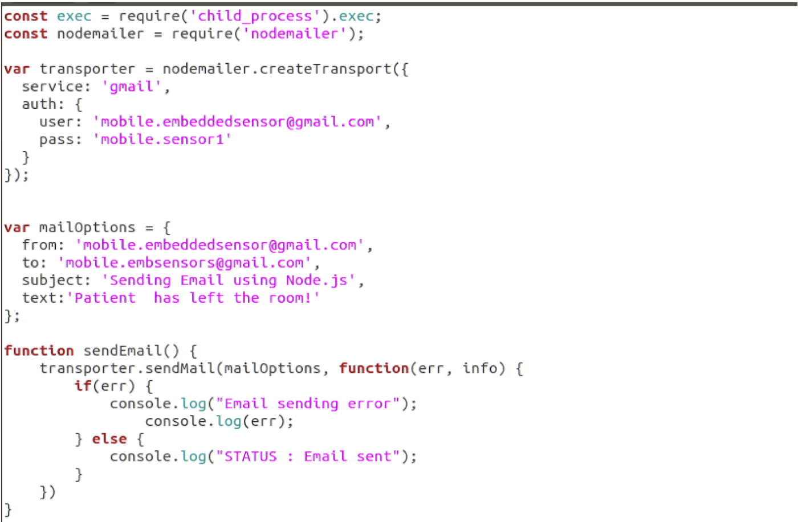
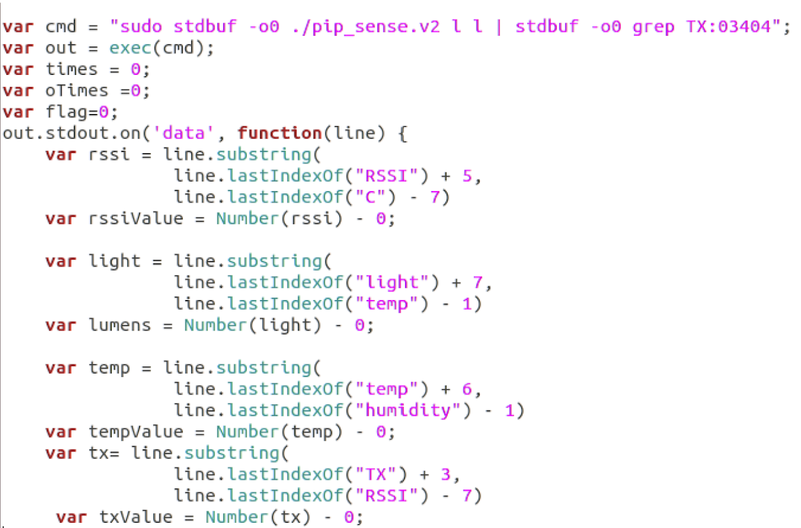
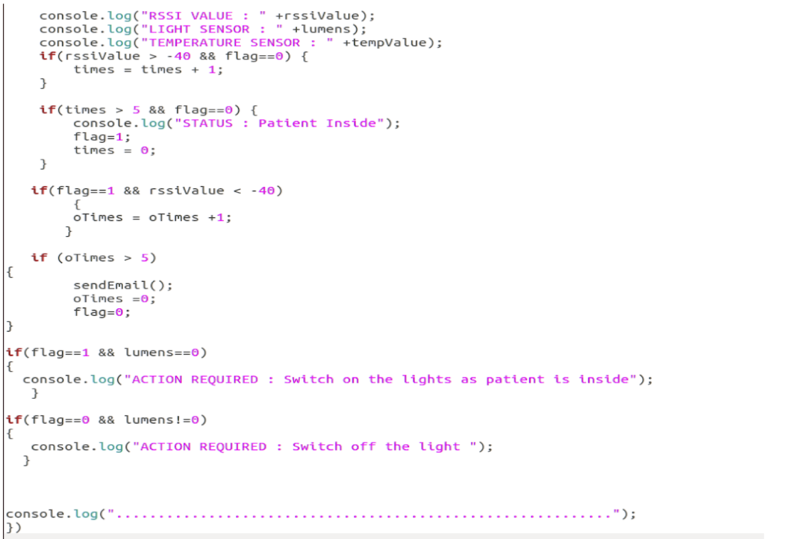
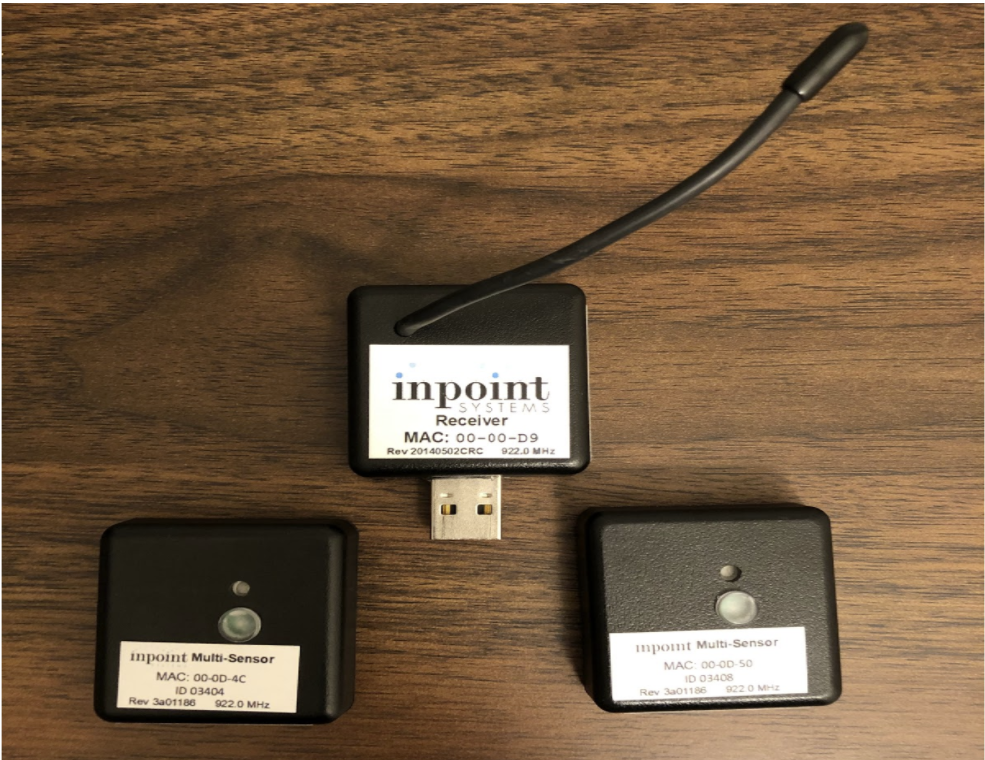
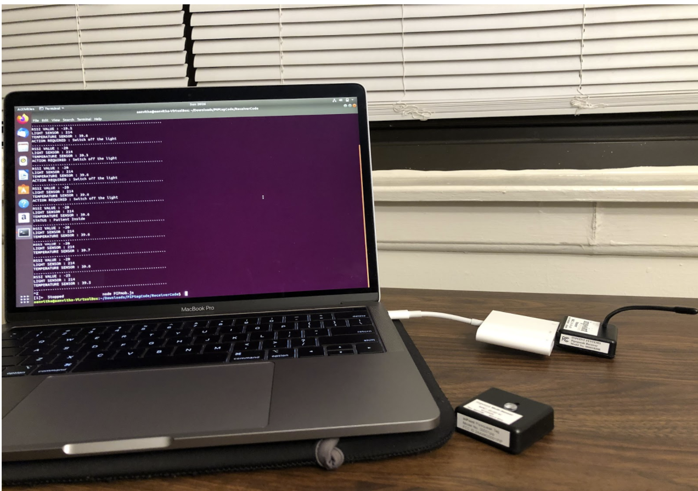
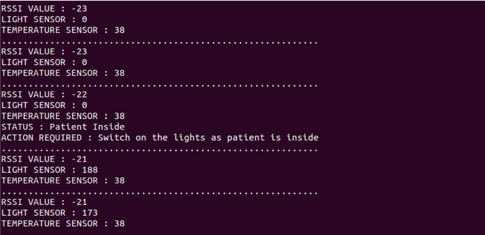

# Patient Tracking and Monitoring Using PIP tags.
>The aim to this project was to create a patient tracking and monitoring application using PIP tags. 

## Table of contents
* [General info](#general-info)
* [Technologies](#technologies)
* [Code](#code)
* [Setup](#setup)
* [Results](#results)

## General info
There are three main objectives of this project.  

* The first one is to identify a patient’s presence in the room. If the patient is present in the assigned room his presence is recorded else a warning notification is triggered to the management.
* The second objective is to monitor the temperature and the humidity in the patient’s room. Each room in a medical facility has a threshold value. If the temperature or humidity falls below or raises above the threshold value, the message is sent to the management so that necessary actions can be taken.
* The third one monitors the light conditions of a room. Depending on the patient presence in the room, the light is turned on/off. This will reduce the patient’s efforts.

This system ensures the security of the patient data and is highly economical compared to the other high-level systems which use GPS for location tracking.

## Technologies
* Programming Language for sensors -  C++.
* Programming Language for application - JavaScript

## Code
* ### Application Code
  * The Nodemailer module from the Node JS.If the patient is not present in the room, the email is sent to the hospital management.
  
  
  * Reading value from PIPtag USB receiver.
    
      

## Setup
Hardware dependencies: 
Software Dependencies: Installing required libraries for PIP tag receiver and sensors, deciding on programming language for the project. 

* ### Hardware dependencies 
  Setup of the Virtual Box with Linux OS, Configuration of the PIP tag sensors and receivers for Linux OS.
    
    
  
* ### Software Dependencies 
  Installing required libraries for [PIP tag receiver](https://github.com/jainsanyam786/Patient_Tracking_and_Monitoring_Using_PIPtags/tree/main/ReceiverCode) and JavaScript code(https://github.com/jainsanyam786/Patient_Tracking_and_Monitoring_Using_PIPtags/blob/main/PIPmob.js). 
  
## Results
* Below is the console output from Demo.
  

